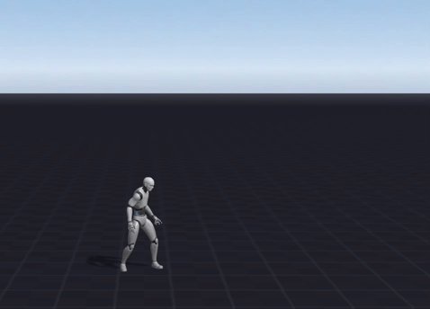

State machine states:

- ```idle```
- ```walkForward```

Scene tree:

```
UserRootObject | 243649C0-D7F6-48FA-A44E-36AD29632827
    MainCharacter | A0DAFCA4-98B7-44FF-B61E-24DDEDB47BB9
        MainCharacter Body | C95EA845-BC44-4DCC-857D-B0257C48D480
            Model | BB27043B-EAFA-4C1D-9D7A-8E7972FF020D
                G_male_base | 70C1E63C-CF27-49A5-BC94-4DC7FBB866A8
                    Animations Internal | 216241CB-F034-426D-8236-8172E9FDEDF8
                        anim_idle | 5F10744A-C4BF-4738-9387-F4092DB60357 | Plain
                            BAF42D48-B587-42ED-9769-D435335E2593
                        anim_walk | A7257985-8B68-4920-86B2-8AC192A744F8 | Plain
                            B99E689B-88C3-4817-AD25-428E99873CA9
            Animations for states | DCDC530D-5CC1-4CAD-BCC7-E88E2B52BA97
                Idle | F0510F68-13C1-4A7A-87B4-875F5569A3C1 | Inserted animations: anim_idle
                Walk | 4EA3F2C5-0643-4F98-A7B6-1A576E3574C6 | Inserted animations: anim_walk
    Item 1 | 69B3343E-0E21-4C30-8FA4-BC470CC0CAF2
```
